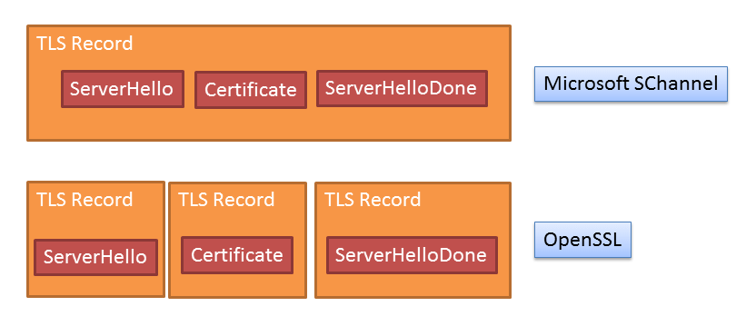

# TLS Prober - An SSL/TLS Server Fingerprinting Tool

## Introduction

Fingerprinting operating systems by analysing the details of the network
stack is a common part of the penetration tester's toolkit. There are a
number of tools available for fingerprinting HTTP servers in order to
determine the server in use when information such as the Server header
is not available. TLS Prober is a new tool that allows you to use
fingerprinting to determine the TLS implementation in use on a server.

There are relatively few TLS implementations in common use, with many
embedded devices and routers using OpenSSL internally. Other widely used
implementations are Java's Secure Socket Extension, Microsoft's SChannel
and GnuTLS. There are existing tools that will extract some information
about the TLS implementation of a server, however they're generally
limited to examining the supported cipher suites. Whilst useful, this is
an unreliable way to detect the implementation in use since it's
entirely possible for two different implementations to be configured to
have matching cipher suites, and further, the set of enabled ciphers is
commonly configured by the system administrator. TLS Prober takes a
different approach and instead analyses differences in behaviour that
are inherent in the implementation and are not affected by configuration
changes.

## How it Works

There are a number of ways that different TLS implementations can
display different behaviour. TLS Prober works by sending messages that
aim to identify these differences. Some of the differences are in the
ways unexpected messages are handled, whilst others occur when we vary
the values of fields within the handshake messages or record layer. TLS
Prober includes tests for differences in the TLS state machine, record
layer and handshake messages.

To make things clearer, let's take a concrete example. When a TLS
connection starts, the client sends a ClientHello. The server then
replies with three handshake messages (assuming we're not using a
Diffie-Hellman key exchange) - ServerHello, Certificate and
ServerHelloDone. TLS is a layered protocol with the lowest being the
record layer. A single record is allowed to contain one or more
handshake messages (in order to minimise the overhead). If we look at
how different servers behave, we can see that whilst SChannel and Java
both pack all three handshake messages into a single record, OpenSSL
does not and sends each handshake in its own record.

TLS Prober sends a number of different requests to the server and
records the responses. These are then compared with the responses stored
in the fingerprint database and those with the greatest number of
matching responses are displayed to the user. In order to avoid getting
confused by the various fields that change each time (such as those
containing random numbers) the information recorded is limited to parts
of the response that don't change.

The code for recording the responses is currently the same for all
probes making writing probes very simple - you only need to worry about
the information you transmit. There's nothing stopping a probe having
custom logic here of course, but it hasn't proved necessary. Below is
the recording of the results for the probe described above when testing
IIS 5.1:

```
*(301)handshake:ServerHello(301)|handshake:Certificate|handshake:ServerHelloDone|
```

The same probe when testing a server running OpenSSL 1.0.1h:

```
*(301)handshake:ServerHello(301)|*(301)handshake:Certificate|*(301)handshake:ServerHelloDone|
```

These signatures are intended to be easy for computers to deal with
rather than people, but we can break them down to understand what we're
seeing. Each time a new TLS record begins a * is recorded, along with
the TLS version number included in the record header. For each message
within the record, we record the content type and message type - here
the content type for all the records is 'handshake', and we get the
message types ServerHello, Certificate and ServerHelloDone as expected.
Like the record, handshake messages contain a version number which gives
us another piece of information to work with.

The fact that there's only a * before the first handshake message in
the IIS signature, but one for each of the handshake messages in the
OpenSSL signature allows us to distinguish between these two
implementations. The following diagram illustrates the difference more
clearly:



Both of these sequences convey the same information in terms of the
handshake messages the client receives - the client doesn't care about
the details of how things are packaged up at the record layer but by
observing the differences we're able to gather more information about
the server implementation.

Of course, a single probe isn't enough to distinguish between
implementations with any degree of reliability, so TLS Prober uses a
number of different ones. Currently it supports the following tests:

-   Normal handshake

-   Sending a ChangeCipherSpec straight after the ClientHello

-   A handshake that only supports EC cipher suites

-   ClientHello that specifies a TLS version of 0x0400 at the record
    layer

-   ClientHello that specifies a TLS version of 0xffff at the record
    layer

-   ClientHello that specifies a TLS version of 0x0000 at the record
    layer

-   ClientHello that specifies a TLS version of 0x0400 in the handshake
    layer

-   ClientHello that specifies a TLS version of 0xffff at the handshake
    layer

-   ClientHello that specifies a TLS version of 0x0000 at the handshake
    layer

-   A ClientHello that has a content type of 17 (which is invalid) at
    the record layer

-   A ClientHello that specifies a length of 0xffff at the record layer

-   A ClientHello that specifies a length of 0x0001 at the record layer

-   A ClientHello followed by a valid heartbeat record

-   A ClientHello followed by a heartbeat record that uses a heartbleed
    exploit

-   A handshake message that contains garbage

-   Sending a ClientHello followed immediately by another ClientHello

-   An empty record followed by the ClientHello

-   A ClientHello split over two TLS records

-   A ClientHello split over two TCP packets

-   A ClientHello with an empty cipher list

-   A ClientHello followed by an empty ChangeCipherSpec

-   A ClientHello with an SNI extension that does not match the target
    hostname

-   A ClientHello with an SNI extension that is very long

-   A ClientHello with an SNI extension that has an empty hostname

These probes were chosen as likely to find edge cases in the
implementations of the record layer parser, handshake layer parser, TLS
state machine and supported TLS features. There are a number of other
possible probes that could be added (for example using different TLS
extensions) but this initial set of tests works well already, and can
successfully distinguish between all the SSL/TLS implementations I've
had access to.

## Why is this Useful?

During penetration testing engagements, it's very common to encounter
systems using SSL/TLS. Sometimes it is possible to determine the TLS
implementation in use from banners or other information that can be
obtained from the target, but this is not always possible. Using TLS
Prober, it is possible to determine which issues may be present on the
target without requiring any further information. In addition, TLS
Prober is extremely useful when information such as banners are
misleading - examples of this include systems such as reverse proxies -
when these are in use the banner information often relates to a
different system. Further, the tool can be used to determine the TLS
implementation in use by embedded devices such as SSL accelerators which
often use libraries such as OpenSSL.

## Implementation

TLS Prober is implemented in python using my pytls library. This library
which was written to allow just this kind of low-level messing around
with TLS messages lets us easily create the kind of invalid messages
required. It runs each probe in turn against the target and then
compares the results with those recorded in the signature database.

The signature database has a text file for each fingerprinted
implementation. This contains a small amount of metadata describing the
fingerprint, and the results of each probe. It is designed so that we
can add new probes without breaking older signatures (though obviously
it is better if we can re-fingerprint an implementation).

Currently, the code simply compares the recorded results directly with
those in the database. In future it might be nice to make this a little
smarter - possible ideas include having a weighting function based on
how effective a given probe is. Another is to implement some kind of
filtering - for example if we see TLS 1.2 support we know the
implementation isn't openssl 0.9.8.
